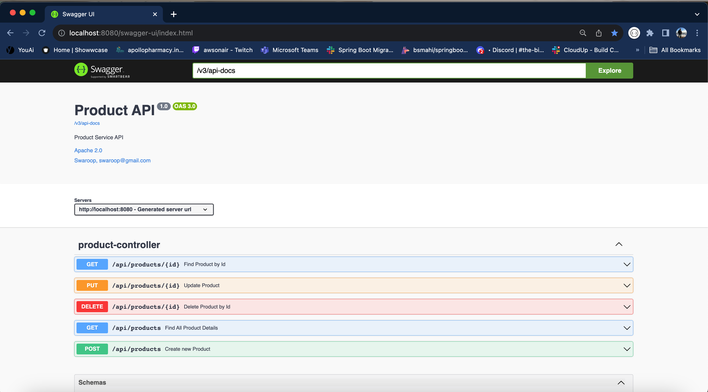
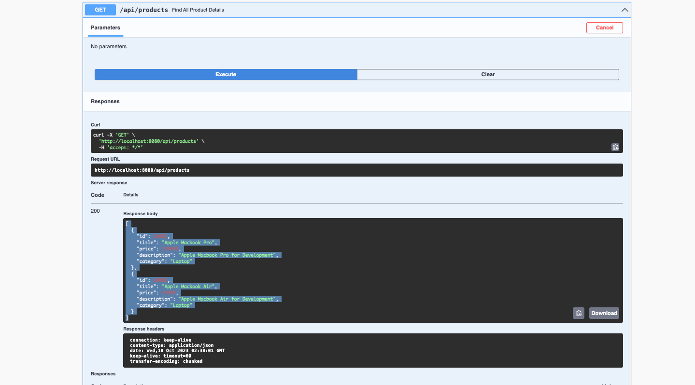
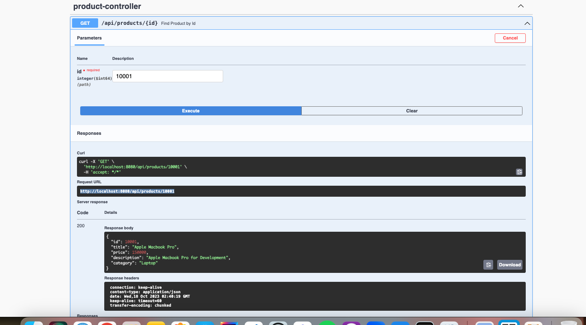
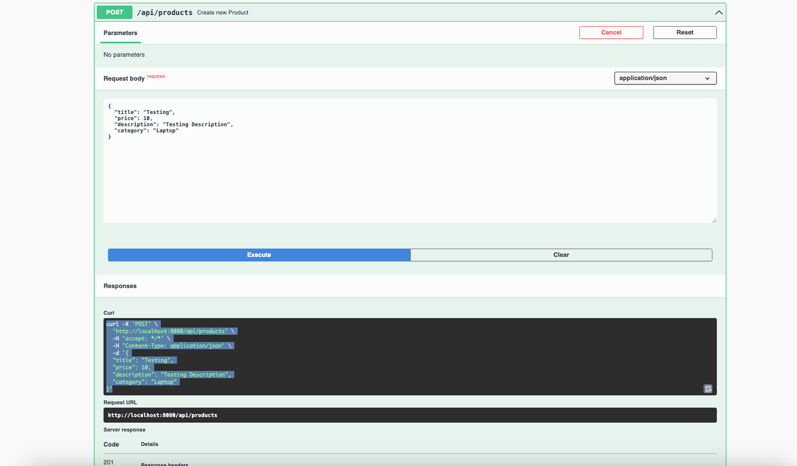
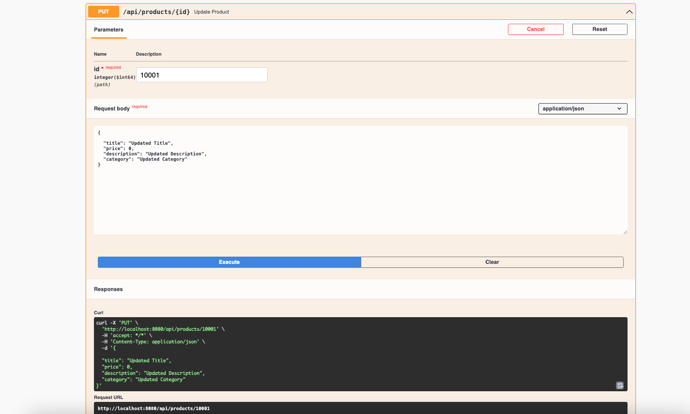
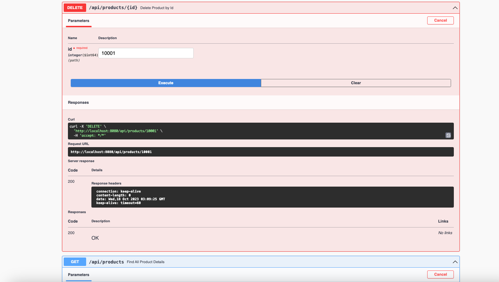

# Build Spring Boot CRUD Application with H2 Database

In this application, we are building a simple CRUD application with h2 for products.
Initially, we shall develop a basic web application utilizing Spring Boot, without resorting to Docker. Subsequently, we
shall construct a Docker image exclusively for the aforementioned application. Let’s get started.

# Building from source

- git clone https://github.com/bsmahi/spring-boot-app-with-h2.git
- Change into root dir
- Run mvn clean install
- mvn spring-boot:run

## Pre-requisites

- [Java 17](https://www.oracle.com/java/technologies/downloads/)
- [Spring Boot CLI](https://docs.spring.io/spring-boot/docs/1.0.2.RELEASE/reference/html/getting-started-installing-spring-boot.html) (
  optional)
- [IntelliJ IDEA](https://www.jetbrains.com/edu-products/download/#section=idea)
- [Docker Desktop](https://docs.docker.com/desktop/?_gl=1*1sq9eto*_ga*MTMzMDc1Mjc4OC4xNjk2NTYwMzgy*_ga_XJWPQMJYHQ*MTY5NzQ2NjQwOS40LjEuMTY5NzQ2Nzg4Mi41OS4wLjA)

## Getting Started

After the successful installation of the tools on your system, please proceed to adhere to the following instructions in
order to construct a basic web application utilizing Spring Boot.

## Starting with Spring Initializr

[Spring Initializr](https://start.spring.io/) is a rapid initiation tool for Spring projects. It offers a flexible
application programming
interface (API) for generating projects based on the Java Virtual Machine (JVM), incorporating various fundamental
language generation options such as Java, Kotlin, and Groovy. Moreover, Spring Initializr facilitates the abstraction of
build systems by providing support for Apache Maven and Gradle implementations.
Furthermore, it exposes web endpoints that enable the generation of tangible projects and the provision of their
metadata in a widely recognized format. This
feature allows third-party clients to offer assistance in areas where it is required.

Open
this [pre-initialized project](https://start.spring.io/#!type=maven-project&language=java&platformVersion=3.1.4&packaging=jar&jvmVersion=17&groupId=com.springapp&artifactId=spring-boot-app-with-h2&name=spring-boot-app-with-h2&description=Demo%20project%20for%20Spring%20Boot&packageName=com.springapp.spring-boot-app-with-h2&dependencies=web,data-jpa,h2,lombok)
in order to generate a ZIP file. Here’s how that looks:

For the purpose of this demonstration, we have combined Maven build automation with Java, a Spring Web, Spring Data Jpa,
H2 database, Lombok dependencies, and Java 17 for our metadata.


Click “Generate” to download **“spring-boot-app-with-h2.zip”**. Use the unzip command to extract your files.

## Project Structure

Once you unzip the file, you’ll see the following project directory structure:

```text
tree spring-boot-app-with-h2 
spring-boot-app-with-h2
├── HELP.md
├── compose.yaml
├── mvnw
├── mvnw.cmd
├── pom.xml
└── src
    ├── main
    │ ├── java
    │ │ └── com
    │ │     └── springapp
    │ │         └── springbootappwithh2
    │ │             └── SpringBootAppWithH2Application.java
    │ └── resources
    │     ├── application.properties
    │     ├── static
    │     └── templates
    └── test
        └── java
            └── com
                └── springapp
                    └── springbootappwithh2
                        └── SpringBootAppWithH2ApplicationTests.java
```

- The `/src/main/java` directory contains project's source code
- The `/src/main/test` directory contains the test source, and the `pom.xml` file is your project's Project Object
  Model(POM)

The `pom.xml` file is the core of a Maven project’s configuration. It’s a single configuration file that contains most
of the information needed to build a customized project. The POM is huge and can seem daunting.
Here’s your project’s POM:

```xml
<?xml version="1.0" encoding="UTF-8"?>
<project xmlns="http://maven.apache.org/POM/4.0.0" xmlns:xsi="http://www.w3.org/2001/XMLSchema-instance"
         xsi:schemaLocation="http://maven.apache.org/POM/4.0.0 https://maven.apache.org/xsd/maven-4.0.0.xsd">
    <modelVersion>4.0.0</modelVersion>
    <parent>
        <groupId>org.springframework.boot</groupId>
        <artifactId>spring-boot-starter-parent</artifactId>
        <version>3.1.4</version>
        <relativePath/> <!-- lookup parent from repository -->
    </parent>
    <groupId>com.springapp</groupId>
    <artifactId>spring-boot-app-with-h2</artifactId>
    <version>0.0.1-SNAPSHOT</version>
    <name>spring-boot-app-with-h2</name>
    <description>Demo project for Spring Boot</description>
    <properties>
        <java.version>17</java.version>
    </properties>
    <dependencies>
        <dependency>
            <groupId>org.springframework.boot</groupId>
            <artifactId>spring-boot-starter-actuator</artifactId>
        </dependency>
        <dependency>
            <groupId>org.springframework.boot</groupId>
            <artifactId>spring-boot-starter-data-jpa</artifactId>
        </dependency>
        <dependency>
            <groupId>org.springframework.boot</groupId>
            <artifactId>spring-boot-starter-web</artifactId>
        </dependency>

        <dependency>
            <groupId>com.h2database</groupId>
            <artifactId>h2</artifactId>
            <scope>runtime</scope>
        </dependency>
        <dependency>
            <groupId>org.projectlombok</groupId>
            <artifactId>lombok</artifactId>
            <optional>true</optional>
        </dependency>
        <dependency>
            <groupId>org.springframework.boot</groupId>
            <artifactId>spring-boot-starter-test</artifactId>
            <scope>test</scope>
        </dependency>
    </dependencies>

    <build>
        <plugins>
            <plugin>
                <groupId>org.springframework.boot</groupId>
                <artifactId>spring-boot-maven-plugin</artifactId>
                <configuration>
                    <excludes>
                        <exclude>
                            <groupId>org.projectlombok</groupId>
                            <artifactId>lombok</artifactId>
                        </exclude>
                    </excludes>
                </configuration>
            </plugin>
        </plugins>
    </build>

</project>
```

The file `SpringBootAppWithH2Application.java` commences by declaring the `com.springapp.springbootappwithh2` package
and importing the requisite Spring frameworks. Numerous Spring Boot developers prefer their applications to employ
auto-configuration,
component scanning, and additional configuration definitions within their "application class."
To enable these functionalities, a solitary `@SpringBootApplication` annotation can be utilized. This annotation also
initiates component scanning for the present package and its sub-packages. It is possible to customize this
configuration and relocate it to
another location by explicitly specifying the base package.

Let us proceed to develop a basic CRUD RESTful web service on Products by means of creating separate packages like
config, controller, entity, exception, repository, and service as demonstrated in the subsequent example:


The H2 database is an in-memory database that is commonly employed for unit testing or proof-of-concept purposes. Spring
Boot offers exceptional integration support for H2 through straightforward properties configuration. In order to enhance
its usability, H2 also offers a console view that allows for the management and interaction with database tables and
data through a graphical user interface.

## Maven

In order to use in-memory database and perform CRUD operations, you need to add the below dependencies:

```xml

<dependency>
    <groupId>org.springframework.boot</groupId>
    <artifactId>spring-boot-starter-data-jpa</artifactId>
</dependency>
<dependency>
<groupId>com.h2database</groupId>
<artifactId>h2</artifactId>
<scope>runtime</scope>
</dependency>
```

## Application Code

- `ProductController.java`- Acts as a presentation layer where you define all the http endpoints
- `Product.java` - Act as a POJO class and table structure with attributes in the form of Java class
- `ProductRepository.java` - Interface which extends JpaRepository which is available from Spring
- `ProductService.java, ProductServiceImpl.java`- Classes for defining method and implementing those methods in
  ProductServiceImpl class
- `Exception` folder - defined for the complete application exception handling
- `Config` folder - defined for the Swagger OpenAPI
- `ProductControllerIT.java` - written Integration Test cases
- `ProductControllerTest.java` - Written UnitTest cases

## H2 Connection Properties

Spring provides effortless configuration options to connect to any database using properties. Below are the
configuration properties, we shall have in application.properties file for the most straightforward H2 configuration.

```properties
# Enabling H2 Console
spring.h2.console.enabled=true
#Turn Statistics on
spring.jpa.properties.hibernate.generate_statistics=true
logging.level.org.hibernate.stat=debug
# Show all queries
spring.jpa.show-sql=true
spring.jpa.properties.hibernate.format_sql=true
logging.level.org.hibernate.type=trace
spring.datasource.url=jdbc:h2:mem:testdb
spring.data.jpa.repositories.bootstrap-mode=default
#Initializing Schema and Data at Startup
spring.jpa.defer-datasource-initialization=true
```

Please note that, by default, Spring Boot configures the connection to the in-memory database with the username `sa` and
an empty password. Should you desire to modify the username and password, it is necessary to override them within the
aforementioned properties options.

- `data.sql` - used for an initial data load to in-memory database

## Accessing H2 Console

The console view of the H2 database is disabled by default. It is necessary to enable it in order to access and view it
through a web browser.

Start the spring boot application and access the console in the browser with this URL : http://localhost:8080/h2-console

## Dockerize the Application

Starting from Spring Boot 2.3 added support for [buildpacks](https://buildpacks.io/), using this we don't manually
create Dockerfile and building
it
using something like `docker build`, all we need to do is a simple configuration in the `pom.xml` under
the `spring-boot-maven-plugin`

```xml

<image>
    <name>bsmahi/${project.artifactId}:${project.version}</name>// here replace `bsmahi` with user docker user name
</image>
<pullPolicy>IF_NOT_PRESENT</pullPolicy>
```

And complete configuration is as follows

```xml

<plugin>
    <groupId>org.springframework.boot</groupId>
    <artifactId>spring-boot-maven-plugin</artifactId>
    <configuration>
        <excludes>
            <exclude>
                <groupId>org.projectlombok</groupId>
                <artifactId>lombok</artifactId>
            </exclude>
        </excludes>
        <image>
            <name>bsmahi/${project.artifactId}:${project.version}</name>
        </image>
        <pullPolicy>IF_NOT_PRESENT</pullPolicy>
    </configuration>
</plugin>
```

And then, execute the following command in the CLI

**NOTE:** **For this to work, we need to have Docker installed and running.**

> **mvn spring-boot:build-image**

## Running app Packages as a JAR File

After successfully building your JAR, it’s time to run the app package as a JAR file:

> java -jar target/spring-boot-app-with-h2-0.0.1-SNAPSHOT.jar

Here are the results:

```log
  .   ____          _            __ _ _
 /\\ / ___'_ __ _ _(_)_ __  __ _ \ \ \ \
( ( )\___ | '_ | '_| | '_ \/ _` | \ \ \ \
 \\/  ___)| |_)| | | | | || (_| |  ) ) ) )
  '  |____| .__|_| |_|_| |_\__, | / / / /
 =========|_|==============|___/=/_/_/_/
 :: Spring Boot ::                (v3.1.4)

2023-10-17T22:03:49.618+05:30  INFO 4466 --- [           main] c.s.s.SpringBootAppWithH2Application     : Starting SpringBootAppWithH2Application using Java 17.0.8.1 with PID 4466 (/Users/puneethsai/springworkspace/spring-boot-applications/spring-boot-app-with-h2/target/classes started by puneethsai in /Users/puneethsai/springworkspace/spring-boot-applications/spring-boot-app-with-h2)
2023-10-17T22:03:49.622+05:30  INFO 4466 --- [           main] c.s.s.SpringBootAppWithH2Application     : No active profile set, falling back to 1 default profile: "default"
2023-10-17T22:03:51.014+05:30  INFO 4466 --- [           main] .s.d.r.c.RepositoryConfigurationDelegate : Bootstrapping Spring Data JPA repositories in DEFAULT mode.
2023-10-17T22:03:51.092+05:30  INFO 4466 --- [           main] .s.d.r.c.RepositoryConfigurationDelegate : Finished Spring Data repository scanning in 61 ms. Found 1 JPA repository interfaces.
2023-10-17T22:03:51.832+05:30  INFO 4466 --- [           main] o.s.b.w.embedded.tomcat.TomcatWebServer  : Tomcat initialized with port(s): 8080 (http)
2023-10-17T22:03:51.845+05:30  INFO 4466 --- [           main] o.apache.catalina.core.StandardService   : Starting service [Tomcat]
2023-10-17T22:03:51.845+05:30  INFO 4466 --- [           main] o.apache.catalina.core.StandardEngine    : Starting Servlet engine: [Apache Tomcat/10.1.13]
2023-10-17T22:03:51.980+05:30  INFO 4466 --- [           main] o.a.c.c.C.[Tomcat].[localhost].[/]       : Initializing Spring embedded WebApplicationContext
2023-10-17T22:03:51.981+05:30  INFO 4466 --- [           main] w.s.c.ServletWebServerApplicationContext : Root WebApplicationContext: initialization completed in 2279 ms
2023-10-17T22:03:52.129+05:30  INFO 4466 --- [           main] com.zaxxer.hikari.HikariDataSource       : HikariPool-1 - Starting...
2023-10-17T22:03:52.335+05:30  INFO 4466 --- [           main] com.zaxxer.hikari.pool.HikariPool        : HikariPool-1 - Added connection conn0: url=jdbc:h2:mem:testdb user=SA
2023-10-17T22:03:52.338+05:30  INFO 4466 --- [           main] com.zaxxer.hikari.HikariDataSource       : HikariPool-1 - Start completed.
2023-10-17T22:03:52.354+05:30  INFO 4466 --- [           main] o.s.b.a.h2.H2ConsoleAutoConfiguration    : H2 console available at '/h2-console'. Database available at 'jdbc:h2:mem:testdb'
2023-10-17T22:03:52.613+05:30  INFO 4466 --- [           main] o.hibernate.jpa.internal.util.LogHelper  : HHH000204: Processing PersistenceUnitInfo [name: default]
2023-10-17T22:03:52.714+05:30  INFO 4466 --- [           main] org.hibernate.Version                    : HHH000412: Hibernate ORM core version 6.2.9.Final
2023-10-17T22:03:52.717+05:30  INFO 4466 --- [           main] org.hibernate.cfg.Environment            : HHH000406: Using bytecode reflection optimizer
2023-10-17T22:03:52.880+05:30 DEBUG 4466 --- [           main] org.hibernate.type.BasicTypeRegistry     : Adding type registration boolean -> org.hibernate.type.BasicTypeReference@1552da16
2023-10-17T22:03:52.880+05:30 DEBUG 4466 --- [           main] org.hibernate.type.BasicTypeRegistry     : Adding type registration boolean -> org.hibernate.type.BasicTypeReference@1552da16
2023-10-17T22:03:52.880+05:30 DEBUG 4466 --- [           main] org.hibernate.type.BasicTypeRegistry     : Adding type registration java.lang.Boolean -> org.hibernate.type.BasicTypeReference@1552da16
2023-10-17T22:03:52.880+05:30 DEBUG 4466 --- [           main] org.hibernate.type.BasicTypeRegistry     : Adding type registration numeric_boolean -> org.hibernate.type.BasicTypeReference@78318ac2
2023-10-17T22:03:52.880+05:30 DEBUG 4466 --- [           main] org.hibernate.type.BasicTypeRegistry     : Adding type registration org.hibernate.type.NumericBooleanConverter -> org.hibernate.type.BasicTypeReference@78318ac2
2023-10-17T22:03:52.880+05:30 DEBUG 4466 --- [           main] org.hibernate.type.BasicTypeRegistry     : Adding type registration true_false -> org.hibernate.type.BasicTypeReference@77ce88c4
2023-10-17T22:03:52.880+05:30 DEBUG 4466 --- [           main] org.hibernate.type.BasicTypeRegistry     : Adding type registration org.hibernate.type.TrueFalseConverter -> org.hibernate.type.BasicTypeReference@77ce88c4
2023-10-17T22:03:52.880+05:30 DEBUG 4466 --- [           main] org.hibernate.type.BasicTypeRegistry     : Adding type registration yes_no -> org.hibernate.type.BasicTypeReference@11abd6c
2023-10-17T22:03:52.880+05:30 DEBUG 4466 --- [           main] org.hibernate.type.BasicTypeRegistry     : Adding type registration org.hibernate.type.YesNoConverter -> org.hibernate.type.BasicTypeReference@11abd6c
2023-10-17T22:03:52.880+05:30 DEBUG 4466 --- [           main] org.hibernate.type.BasicTypeRegistry     : Adding type registration byte -> org.hibernate.type.BasicTypeReference@29b5533
2023-10-17T22:03:52.881+05:30 DEBUG 4466 --- [           main] org.hibernate.type.BasicTypeRegistry     : Adding type registration byte -> org.hibernate.type.BasicTypeReference@29b5533
2023-10-17T22:03:52.881+05:30 DEBUG 4466 --- [           main] org.hibernate.type.BasicTypeRegistry     : Adding type registration java.lang.Byte -> org.hibernate.type.BasicTypeReference@29b5533
2023-10-17T22:03:52.881+05:30 DEBUG 4466 --- [           main] org.hibernate.type.BasicTypeRegistry     : Adding type registration binary -> org.hibernate.type.BasicTypeReference@7608a838
2023-10-17T22:03:52.881+05:30 DEBUG 4466 --- [           main] org.hibernate.type.BasicTypeRegistry     : Adding type registration byte[] -> org.hibernate.type.BasicTypeReference@7608a838
2023-10-17T22:03:52.881+05:30 DEBUG 4466 --- [           main] org.hibernate.type.BasicTypeRegistry     : Adding type registration [B -> org.hibernate.type.BasicTypeReference@7608a838
2023-10-17T22:03:52.882+05:30 DEBUG 4466 --- [           main] org.hibernate.type.BasicTypeRegistry     : Adding type registration binary_wrapper -> org.hibernate.type.BasicTypeReference@794c5f5e
2023-10-17T22:03:52.882+05:30 DEBUG 4466 --- [           main] org.hibernate.type.BasicTypeRegistry     : Adding type registration wrapper-binary -> org.hibernate.type.BasicTypeReference@794c5f5e
2023-10-17T22:03:52.882+05:30 DEBUG 4466 --- [           main] org.hibernate.type.BasicTypeRegistry     : Adding type registration image -> org.hibernate.type.BasicTypeReference@4ab66127
2023-10-17T22:03:52.882+05:30 DEBUG 4466 --- [           main] org.hibernate.type.BasicTypeRegistry     : Adding type registration blob -> org.hibernate.type.BasicTypeReference@236861da
2023-10-17T22:03:52.882+05:30 DEBUG 4466 --- [           main] org.hibernate.type.BasicTypeRegistry     : Adding type registration java.sql.Blob -> org.hibernate.type.BasicTypeReference@236861da
2023-10-17T22:03:52.882+05:30 DEBUG 4466 --- [           main] org.hibernate.type.BasicTypeRegistry     : Adding type registration materialized_blob -> org.hibernate.type.BasicTypeReference@37fef327
2023-10-17T22:03:52.882+05:30 DEBUG 4466 --- [           main] org.hibernate.type.BasicTypeRegistry     : Adding type registration materialized_blob_wrapper -> org.hibernate.type.BasicTypeReference@2cd3fc29
2023-10-17T22:03:52.882+05:30 DEBUG 4466 --- [           main] org.hibernate.type.BasicTypeRegistry     : Adding type registration short -> org.hibernate.type.BasicTypeReference@55951fcd
2023-10-17T22:03:52.882+05:30 DEBUG 4466 --- [           main] org.hibernate.type.BasicTypeRegistry     : Adding type registration short -> org.hibernate.type.BasicTypeReference@55951fcd
2023-10-17T22:03:52.882+05:30 DEBUG 4466 --- [           main] org.hibernate.type.BasicTypeRegistry     : Adding type registration java.lang.Short -> org.hibernate.type.BasicTypeReference@55951fcd
2023-10-17T22:03:52.882+05:30 DEBUG 4466 --- [           main] org.hibernate.type.BasicTypeRegistry     : Adding type registration integer -> org.hibernate.type.BasicTypeReference@3513d214
2023-10-17T22:03:52.882+05:30 DEBUG 4466 --- [           main] org.hibernate.type.BasicTypeRegistry     : Adding type registration int -> org.hibernate.type.BasicTypeReference@3513d214
2023-10-17T22:03:52.883+05:30 DEBUG 4466 --- [           main] org.hibernate.type.BasicTypeRegistry     : Adding type registration java.lang.Integer -> org.hibernate.type.BasicTypeReference@3513d214
2023-10-17T22:03:52.883+05:30 DEBUG 4466 --- [           main] org.hibernate.type.BasicTypeRegistry     : Adding type registration long -> org.hibernate.type.BasicTypeReference@7534785a
2023-10-17T22:03:52.883+05:30 DEBUG 4466 --- [           main] org.hibernate.type.BasicTypeRegistry     : Adding type registration long -> org.hibernate.type.BasicTypeReference@7534785a
2023-10-17T22:03:52.883+05:30 DEBUG 4466 --- [           main] org.hibernate.type.BasicTypeRegistry     : Adding type registration java.lang.Long -> org.hibernate.type.BasicTypeReference@7534785a
2023-10-17T22:03:52.883+05:30 DEBUG 4466 --- [           main] org.hibernate.type.BasicTypeRegistry     : Adding type registration float -> org.hibernate.type.BasicTypeReference@46b5f061
2023-10-17T22:03:52.883+05:30 DEBUG 4466 --- [           main] org.hibernate.type.BasicTypeRegistry     : Adding type registration float -> org.hibernate.type.BasicTypeReference@46b5f061
2023-10-17T22:03:52.883+05:30 DEBUG 4466 --- [           main] org.hibernate.type.BasicTypeRegistry     : Adding type registration java.lang.Float -> org.hibernate.type.BasicTypeReference@46b5f061
2023-10-17T22:03:52.884+05:30 DEBUG 4466 --- [           main] org.hibernate.type.BasicTypeRegistry     : Adding type registration double -> org.hibernate.type.BasicTypeReference@3ba3f40d
2023-10-17T22:03:52.884+05:30 DEBUG 4466 --- [           main] org.hibernate.type.BasicTypeRegistry     : Adding type registration double -> org.hibernate.type.BasicTypeReference@3ba3f40d
2023-10-17T22:03:52.884+05:30 DEBUG 4466 --- [           main] org.hibernate.type.BasicTypeRegistry     : Adding type registration java.lang.Double -> org.hibernate.type.BasicTypeReference@3ba3f40d
2023-10-17T22:03:52.884+05:30 DEBUG 4466 --- [           main] org.hibernate.type.BasicTypeRegistry     : Adding type registration big_integer -> org.hibernate.type.BasicTypeReference@108b121f
2023-10-17T22:03:52.884+05:30 DEBUG 4466 --- [           main] org.hibernate.type.BasicTypeRegistry     : Adding type registration java.math.BigInteger -> org.hibernate.type.BasicTypeReference@108b121f
2023-10-17T22:03:52.884+05:30 DEBUG 4466 --- [           main] org.hibernate.type.BasicTypeRegistry     : Adding type registration big_decimal -> org.hibernate.type.BasicTypeReference@46ab4efc
2023-10-17T22:03:52.884+05:30 DEBUG 4466 --- [           main] org.hibernate.type.BasicTypeRegistry     : Adding type registration java.math.BigDecimal -> org.hibernate.type.BasicTypeReference@46ab4efc
2023-10-17T22:03:52.885+05:30 DEBUG 4466 --- [           main] org.hibernate.type.BasicTypeRegistry     : Adding type registration character -> org.hibernate.type.BasicTypeReference@2ff498b0
2023-10-17T22:03:52.885+05:30 DEBUG 4466 --- [           main] org.hibernate.type.BasicTypeRegistry     : Adding type registration char -> org.hibernate.type.BasicTypeReference@2ff498b0
2023-10-17T22:03:52.885+05:30 DEBUG 4466 --- [           main] org.hibernate.type.BasicTypeRegistry     : Adding type registration java.lang.Character -> org.hibernate.type.BasicTypeReference@2ff498b0
2023-10-17T22:03:52.885+05:30 DEBUG 4466 --- [           main] org.hibernate.type.BasicTypeRegistry     : Adding type registration character_nchar -> org.hibernate.type.BasicTypeReference@b5312df
2023-10-17T22:03:52.885+05:30 DEBUG 4466 --- [           main] org.hibernate.type.BasicTypeRegistry     : Adding type registration string -> org.hibernate.type.BasicTypeReference@4300e240
2023-10-17T22:03:52.885+05:30 DEBUG 4466 --- [           main] org.hibernate.type.BasicTypeRegistry     : Adding type registration java.lang.String -> org.hibernate.type.BasicTypeReference@4300e240
2023-10-17T22:03:52.885+05:30 DEBUG 4466 --- [           main] org.hibernate.type.BasicTypeRegistry     : Adding type registration nstring -> org.hibernate.type.BasicTypeReference@5f409872
2023-10-17T22:03:52.885+05:30 DEBUG 4466 --- [           main] org.hibernate.type.BasicTypeRegistry     : Adding type registration characters -> org.hibernate.type.BasicTypeReference@547aaa32
2023-10-17T22:03:52.885+05:30 DEBUG 4466 --- [           main] org.hibernate.type.BasicTypeRegistry     : Adding type registration char[] -> org.hibernate.type.BasicTypeReference@547aaa32
2023-10-17T22:03:52.885+05:30 DEBUG 4466 --- [           main] org.hibernate.type.BasicTypeRegistry     : Adding type registration [C -> org.hibernate.type.BasicTypeReference@547aaa32
2023-10-17T22:03:52.886+05:30 DEBUG 4466 --- [           main] org.hibernate.type.BasicTypeRegistry     : Adding type registration wrapper-characters -> org.hibernate.type.BasicTypeReference@472c9f88
2023-10-17T22:03:52.886+05:30 DEBUG 4466 --- [           main] org.hibernate.type.BasicTypeRegistry     : Adding type registration text -> org.hibernate.type.BasicTypeReference@37a67cf
2023-10-17T22:03:52.886+05:30 DEBUG 4466 --- [           main] org.hibernate.type.BasicTypeRegistry     : Adding type registration ntext -> org.hibernate.type.BasicTypeReference@5822ecda
2023-10-17T22:03:52.886+05:30 DEBUG 4466 --- [           main] org.hibernate.type.BasicTypeRegistry     : Adding type registration clob -> org.hibernate.type.BasicTypeReference@5908e6d6
2023-10-17T22:03:52.886+05:30 DEBUG 4466 --- [           main] org.hibernate.type.BasicTypeRegistry     : Adding type registration java.sql.Clob -> org.hibernate.type.BasicTypeReference@5908e6d6
2023-10-17T22:03:52.886+05:30 DEBUG 4466 --- [           main] org.hibernate.type.BasicTypeRegistry     : Adding type registration nclob -> org.hibernate.type.BasicTypeReference@7afbf2a0
2023-10-17T22:03:52.886+05:30 DEBUG 4466 --- [           main] org.hibernate.type.BasicTypeRegistry     : Adding type registration java.sql.NClob -> org.hibernate.type.BasicTypeReference@7afbf2a0
2023-10-17T22:03:52.886+05:30 DEBUG 4466 --- [           main] org.hibernate.type.BasicTypeRegistry     : Adding type registration materialized_clob -> org.hibernate.type.BasicTypeReference@2a6fb62f
2023-10-17T22:03:52.886+05:30 DEBUG 4466 --- [           main] org.hibernate.type.BasicTypeRegistry     : Adding type registration materialized_clob_char_array -> org.hibernate.type.BasicTypeReference@65e4cb84
2023-10-17T22:03:52.886+05:30 DEBUG 4466 --- [           main] org.hibernate.type.BasicTypeRegistry     : Adding type registration materialized_clob_character_array -> org.hibernate.type.BasicTypeReference@7b44bfb8
2023-10-17T22:03:52.886+05:30 DEBUG 4466 --- [           main] org.hibernate.type.BasicTypeRegistry     : Adding type registration materialized_nclob -> org.hibernate.type.BasicTypeReference@5e0f2c82
2023-10-17T22:03:52.886+05:30 DEBUG 4466 --- [           main] org.hibernate.type.BasicTypeRegistry     : Adding type registration materialized_nclob_character_array -> org.hibernate.type.BasicTypeReference@98637a2
2023-10-17T22:03:52.886+05:30 DEBUG 4466 --- [           main] org.hibernate.type.BasicTypeRegistry     : Adding type registration materialized_nclob_char_array -> org.hibernate.type.BasicTypeReference@4afd65fd
2023-10-17T22:03:52.887+05:30 DEBUG 4466 --- [           main] org.hibernate.type.BasicTypeRegistry     : Adding type registration Duration -> org.hibernate.type.BasicTypeReference@141aba65
2023-10-17T22:03:52.887+05:30 DEBUG 4466 --- [           main] org.hibernate.type.BasicTypeRegistry     : Adding type registration java.time.Duration -> org.hibernate.type.BasicTypeReference@141aba65
2023-10-17T22:03:52.887+05:30 DEBUG 4466 --- [           main] org.hibernate.type.BasicTypeRegistry     : Adding type registration LocalDateTime -> org.hibernate.type.BasicTypeReference@3356ff58
2023-10-17T22:03:52.887+05:30 DEBUG 4466 --- [           main] org.hibernate.type.BasicTypeRegistry     : Adding type registration java.time.LocalDateTime -> org.hibernate.type.BasicTypeReference@3356ff58
2023-10-17T22:03:52.887+05:30 DEBUG 4466 --- [           main] org.hibernate.type.BasicTypeRegistry     : Adding type registration LocalDate -> org.hibernate.type.BasicTypeReference@b55f5b7
2023-10-17T22:03:52.887+05:30 DEBUG 4466 --- [           main] org.hibernate.type.BasicTypeRegistry     : Adding type registration java.time.LocalDate -> org.hibernate.type.BasicTypeReference@b55f5b7
2023-10-17T22:03:52.887+05:30 DEBUG 4466 --- [           main] org.hibernate.type.BasicTypeRegistry     : Adding type registration LocalTime -> org.hibernate.type.BasicTypeReference@2aa6bbad
2023-10-17T22:03:52.887+05:30 DEBUG 4466 --- [           main] org.hibernate.type.BasicTypeRegistry     : Adding type registration java.time.LocalTime -> org.hibernate.type.BasicTypeReference@2aa6bbad
2023-10-17T22:03:52.887+05:30 DEBUG 4466 --- [           main] org.hibernate.type.BasicTypeRegistry     : Adding type registration OffsetDateTime -> org.hibernate.type.BasicTypeReference@6b2ef50e
2023-10-17T22:03:52.887+05:30 DEBUG 4466 --- [           main] org.hibernate.type.BasicTypeRegistry     : Adding type registration java.time.OffsetDateTime -> org.hibernate.type.BasicTypeReference@6b2ef50e
2023-10-17T22:03:52.887+05:30 DEBUG 4466 --- [           main] org.hibernate.type.BasicTypeRegistry     : Adding type registration OffsetDateTimeWithTimezone -> org.hibernate.type.BasicTypeReference@6f867b0c
2023-10-17T22:03:52.887+05:30 DEBUG 4466 --- [           main] org.hibernate.type.BasicTypeRegistry     : Adding type registration OffsetDateTimeWithoutTimezone -> org.hibernate.type.BasicTypeReference@4b5ad306
2023-10-17T22:03:52.887+05:30 DEBUG 4466 --- [           main] org.hibernate.type.BasicTypeRegistry     : Adding type registration OffsetTime -> org.hibernate.type.BasicTypeReference@54be6213
2023-10-17T22:03:52.887+05:30 DEBUG 4466 --- [           main] org.hibernate.type.BasicTypeRegistry     : Adding type registration java.time.OffsetTime -> org.hibernate.type.BasicTypeReference@54be6213
2023-10-17T22:03:52.888+05:30 DEBUG 4466 --- [           main] org.hibernate.type.BasicTypeRegistry     : Adding type registration OffsetTimeUtc -> org.hibernate.type.BasicTypeReference@48a46b0f
2023-10-17T22:03:52.888+05:30 DEBUG 4466 --- [           main] org.hibernate.type.BasicTypeRegistry     : Adding type registration OffsetTimeWithTimezone -> org.hibernate.type.BasicTypeReference@1426370c
2023-10-17T22:03:52.888+05:30 DEBUG 4466 --- [           main] org.hibernate.type.BasicTypeRegistry     : Adding type registration OffsetTimeWithoutTimezone -> org.hibernate.type.BasicTypeReference@9f9146d
2023-10-17T22:03:52.888+05:30 DEBUG 4466 --- [           main] org.hibernate.type.BasicTypeRegistry     : Adding type registration ZonedDateTime -> org.hibernate.type.BasicTypeReference@2ef041bb
2023-10-17T22:03:52.888+05:30 DEBUG 4466 --- [           main] org.hibernate.type.BasicTypeRegistry     : Adding type registration java.time.ZonedDateTime -> org.hibernate.type.BasicTypeReference@2ef041bb
2023-10-17T22:03:52.888+05:30 DEBUG 4466 --- [           main] org.hibernate.type.BasicTypeRegistry     : Adding type registration ZonedDateTimeWithTimezone -> org.hibernate.type.BasicTypeReference@45e7bb79
2023-10-17T22:03:52.888+05:30 DEBUG 4466 --- [           main] org.hibernate.type.BasicTypeRegistry     : Adding type registration ZonedDateTimeWithoutTimezone -> org.hibernate.type.BasicTypeReference@605c7a9e
2023-10-17T22:03:52.888+05:30 DEBUG 4466 --- [           main] org.hibernate.type.BasicTypeRegistry     : Adding type registration date -> org.hibernate.type.BasicTypeReference@21c75084
2023-10-17T22:03:52.888+05:30 DEBUG 4466 --- [           main] org.hibernate.type.BasicTypeRegistry     : Adding type registration java.sql.Date -> org.hibernate.type.BasicTypeReference@21c75084
2023-10-17T22:03:52.888+05:30 DEBUG 4466 --- [           main] org.hibernate.type.BasicTypeRegistry     : Adding type registration time -> org.hibernate.type.BasicTypeReference@d16209e
2023-10-17T22:03:52.888+05:30 DEBUG 4466 --- [           main] org.hibernate.type.BasicTypeRegistry     : Adding type registration java.sql.Time -> org.hibernate.type.BasicTypeReference@d16209e
2023-10-17T22:03:52.888+05:30 DEBUG 4466 --- [           main] org.hibernate.type.BasicTypeRegistry     : Adding type registration timestamp -> org.hibernate.type.BasicTypeReference@75527e36
2023-10-17T22:03:52.888+05:30 DEBUG 4466 --- [           main] org.hibernate.type.BasicTypeRegistry     : Adding type registration java.sql.Timestamp -> org.hibernate.type.BasicTypeReference@75527e36
2023-10-17T22:03:52.888+05:30 DEBUG 4466 --- [           main] org.hibernate.type.BasicTypeRegistry     : Adding type registration java.util.Date -> org.hibernate.type.BasicTypeReference@75527e36
2023-10-17T22:03:52.888+05:30 DEBUG 4466 --- [           main] org.hibernate.type.BasicTypeRegistry     : Adding type registration calendar -> org.hibernate.type.BasicTypeReference@76596288
2023-10-17T22:03:52.888+05:30 DEBUG 4466 --- [           main] org.hibernate.type.BasicTypeRegistry     : Adding type registration java.util.Calendar -> org.hibernate.type.BasicTypeReference@76596288
2023-10-17T22:03:52.889+05:30 DEBUG 4466 --- [           main] org.hibernate.type.BasicTypeRegistry     : Adding type registration java.util.GregorianCalendar -> org.hibernate.type.BasicTypeReference@76596288
2023-10-17T22:03:52.889+05:30 DEBUG 4466 --- [           main] org.hibernate.type.BasicTypeRegistry     : Adding type registration calendar_date -> org.hibernate.type.BasicTypeReference@6d815fb7
2023-10-17T22:03:52.889+05:30 DEBUG 4466 --- [           main] org.hibernate.type.BasicTypeRegistry     : Adding type registration calendar_time -> org.hibernate.type.BasicTypeReference@51af8049
2023-10-17T22:03:52.889+05:30 DEBUG 4466 --- [           main] org.hibernate.type.BasicTypeRegistry     : Adding type registration instant -> org.hibernate.type.BasicTypeReference@376af784
2023-10-17T22:03:52.889+05:30 DEBUG 4466 --- [           main] org.hibernate.type.BasicTypeRegistry     : Adding type registration java.time.Instant -> org.hibernate.type.BasicTypeReference@376af784
2023-10-17T22:03:52.889+05:30 DEBUG 4466 --- [           main] org.hibernate.type.BasicTypeRegistry     : Adding type registration uuid -> org.hibernate.type.BasicTypeReference@a9a8ec3
2023-10-17T22:03:52.889+05:30 DEBUG 4466 --- [           main] org.hibernate.type.BasicTypeRegistry     : Adding type registration java.util.UUID -> org.hibernate.type.BasicTypeReference@a9a8ec3
2023-10-17T22:03:52.889+05:30 DEBUG 4466 --- [           main] org.hibernate.type.BasicTypeRegistry     : Adding type registration pg-uuid -> org.hibernate.type.BasicTypeReference@a9a8ec3
2023-10-17T22:03:52.889+05:30 DEBUG 4466 --- [           main] org.hibernate.type.BasicTypeRegistry     : Adding type registration uuid-binary -> org.hibernate.type.BasicTypeReference@6d0114c0
2023-10-17T22:03:52.889+05:30 DEBUG 4466 --- [           main] org.hibernate.type.BasicTypeRegistry     : Adding type registration uuid-char -> org.hibernate.type.BasicTypeReference@40016ce1
2023-10-17T22:03:52.889+05:30 DEBUG 4466 --- [           main] org.hibernate.type.BasicTypeRegistry     : Adding type registration class -> org.hibernate.type.BasicTypeReference@203765b2
2023-10-17T22:03:52.889+05:30 DEBUG 4466 --- [           main] org.hibernate.type.BasicTypeRegistry     : Adding type registration java.lang.Class -> org.hibernate.type.BasicTypeReference@203765b2
2023-10-17T22:03:52.889+05:30 DEBUG 4466 --- [           main] org.hibernate.type.BasicTypeRegistry     : Adding type registration currency -> org.hibernate.type.BasicTypeReference@7e050be1
2023-10-17T22:03:52.889+05:30 DEBUG 4466 --- [           main] org.hibernate.type.BasicTypeRegistry     : Adding type registration Currency -> org.hibernate.type.BasicTypeReference@7e050be1
2023-10-17T22:03:52.890+05:30 DEBUG 4466 --- [           main] org.hibernate.type.BasicTypeRegistry     : Adding type registration java.util.Currency -> org.hibernate.type.BasicTypeReference@7e050be1
2023-10-17T22:03:52.890+05:30 DEBUG 4466 --- [           main] org.hibernate.type.BasicTypeRegistry     : Adding type registration locale -> org.hibernate.type.BasicTypeReference@1b47b7f5
2023-10-17T22:03:52.890+05:30 DEBUG 4466 --- [           main] org.hibernate.type.BasicTypeRegistry     : Adding type registration java.util.Locale -> org.hibernate.type.BasicTypeReference@1b47b7f5
2023-10-17T22:03:52.890+05:30 DEBUG 4466 --- [           main] org.hibernate.type.BasicTypeRegistry     : Adding type registration serializable -> org.hibernate.type.BasicTypeReference@506aa618
2023-10-17T22:03:52.890+05:30 DEBUG 4466 --- [           main] org.hibernate.type.BasicTypeRegistry     : Adding type registration java.io.Serializable -> org.hibernate.type.BasicTypeReference@506aa618
2023-10-17T22:03:52.890+05:30 DEBUG 4466 --- [           main] org.hibernate.type.BasicTypeRegistry     : Adding type registration timezone -> org.hibernate.type.BasicTypeReference@4b6b5352
2023-10-17T22:03:52.890+05:30 DEBUG 4466 --- [           main] org.hibernate.type.BasicTypeRegistry     : Adding type registration java.util.TimeZone -> org.hibernate.type.BasicTypeReference@4b6b5352
2023-10-17T22:03:52.890+05:30 DEBUG 4466 --- [           main] org.hibernate.type.BasicTypeRegistry     : Adding type registration ZoneOffset -> org.hibernate.type.BasicTypeReference@1d6713dd
2023-10-17T22:03:52.890+05:30 DEBUG 4466 --- [           main] org.hibernate.type.BasicTypeRegistry     : Adding type registration java.time.ZoneOffset -> org.hibernate.type.BasicTypeReference@1d6713dd
2023-10-17T22:03:52.890+05:30 DEBUG 4466 --- [           main] org.hibernate.type.BasicTypeRegistry     : Adding type registration url -> org.hibernate.type.BasicTypeReference@3b39e79b
2023-10-17T22:03:52.890+05:30 DEBUG 4466 --- [           main] org.hibernate.type.BasicTypeRegistry     : Adding type registration java.net.URL -> org.hibernate.type.BasicTypeReference@3b39e79b
2023-10-17T22:03:52.890+05:30 DEBUG 4466 --- [           main] org.hibernate.type.BasicTypeRegistry     : Adding type registration row_version -> org.hibernate.type.BasicTypeReference@3ee6dc82
2023-10-17T22:03:52.896+05:30 DEBUG 4466 --- [           main] org.hibernate.type.BasicTypeRegistry     : Adding type registration object -> org.hibernate.type.JavaObjectType@bd4ee01
2023-10-17T22:03:52.897+05:30 DEBUG 4466 --- [           main] org.hibernate.type.BasicTypeRegistry     : Adding type registration java.lang.Object -> org.hibernate.type.JavaObjectType@bd4ee01
2023-10-17T22:03:52.898+05:30 DEBUG 4466 --- [           main] org.hibernate.type.BasicTypeRegistry     : Adding type registration null -> org.hibernate.type.NullType@2321e482
2023-10-17T22:03:52.898+05:30 DEBUG 4466 --- [           main] org.hibernate.type.BasicTypeRegistry     : Adding type registration imm_date -> org.hibernate.type.BasicTypeReference@467ef400
2023-10-17T22:03:52.898+05:30 DEBUG 4466 --- [           main] org.hibernate.type.BasicTypeRegistry     : Adding type registration imm_time -> org.hibernate.type.BasicTypeReference@13fe5bb7
2023-10-17T22:03:52.899+05:30 DEBUG 4466 --- [           main] org.hibernate.type.BasicTypeRegistry     : Adding type registration imm_timestamp -> org.hibernate.type.BasicTypeReference@4276ad40
2023-10-17T22:03:52.899+05:30 DEBUG 4466 --- [           main] org.hibernate.type.BasicTypeRegistry     : Adding type registration imm_calendar -> org.hibernate.type.BasicTypeReference@6e5f5478
2023-10-17T22:03:52.899+05:30 DEBUG 4466 --- [           main] org.hibernate.type.BasicTypeRegistry     : Adding type registration imm_calendar_date -> org.hibernate.type.BasicTypeReference@5fb07347
2023-10-17T22:03:52.899+05:30 DEBUG 4466 --- [           main] org.hibernate.type.BasicTypeRegistry     : Adding type registration imm_calendar_time -> org.hibernate.type.BasicTypeReference@3ef2b8e5
2023-10-17T22:03:52.899+05:30 DEBUG 4466 --- [           main] org.hibernate.type.BasicTypeRegistry     : Adding type registration imm_binary -> org.hibernate.type.BasicTypeReference@49190ed6
2023-10-17T22:03:52.899+05:30 DEBUG 4466 --- [           main] org.hibernate.type.BasicTypeRegistry     : Adding type registration imm_serializable -> org.hibernate.type.BasicTypeReference@5d717f19
2023-10-17T22:03:52.928+05:30  INFO 4466 --- [           main] o.h.b.i.BytecodeProviderInitiator        : HHH000021: Bytecode provider name : bytebuddy
2023-10-17T22:03:53.140+05:30  INFO 4466 --- [           main] o.s.o.j.p.SpringPersistenceUnitInfo      : No LoadTimeWeaver setup: ignoring JPA class transformer
2023-10-17T22:03:53.258+05:30 DEBUG 4466 --- [           main] o.h.t.d.jdbc.spi.JdbcTypeRegistry        : addDescriptor(NCharTypeDescriptor) replaced previous registration(CharTypeDescriptor)
2023-10-17T22:03:53.258+05:30 DEBUG 4466 --- [           main] o.h.t.d.jdbc.spi.JdbcTypeRegistry        : addDescriptor(NVarcharTypeDescriptor) replaced previous registration(VarcharTypeDescriptor)
2023-10-17T22:03:53.259+05:30 DEBUG 4466 --- [           main] o.h.t.d.jdbc.spi.JdbcTypeRegistry        : addDescriptor(LongNVarcharTypeDescriptor) replaced previous registration(LongVarcharTypeDescriptor)
2023-10-17T22:03:53.262+05:30 DEBUG 4466 --- [           main] o.h.t.d.jdbc.spi.JdbcTypeRegistry        : addDescriptor(NClobTypeDescriptor(DEFAULT)) replaced previous registration(ClobTypeDescriptor(DEFAULT))
2023-10-17T22:03:53.264+05:30 DEBUG 4466 --- [           main] o.h.t.d.jdbc.spi.JdbcTypeRegistry        : addDescriptor(2005, ClobTypeDescriptor(STREAM_BINDING)) replaced previous registration(ClobTypeDescriptor(DEFAULT))
2023-10-17T22:03:53.273+05:30 DEBUG 4466 --- [           main] o.h.t.d.jdbc.spi.JdbcTypeRegistry        : addDescriptor(TimestampUtcDescriptor) replaced previous registration(TimestampUtcDescriptor)
2023-10-17T22:03:53.279+05:30 DEBUG 4466 --- [           main] org.hibernate.type.BasicTypeRegistry     : Adding type registration Duration -> basicType@1(java.time.Duration,2)
2023-10-17T22:03:53.280+05:30 DEBUG 4466 --- [           main] org.hibernate.type.BasicTypeRegistry     : Adding type registration java.time.Duration -> basicType@1(java.time.Duration,2)
2023-10-17T22:03:53.285+05:30 DEBUG 4466 --- [           main] o.h.type.spi.TypeConfiguration$Scope     : Scoping TypeConfiguration [org.hibernate.type.spi.TypeConfiguration@1c8f71a7] to MetadataBuildingContext [org.hibernate.boot.internal.MetadataBuildingContextRootImpl@27e21083]
2023-10-17T22:03:53.527+05:30  INFO 4466 --- [           main] o.h.b.i.BytecodeProviderInitiator        : HHH000021: Bytecode provider name : bytebuddy
2023-10-17T22:03:54.330+05:30  INFO 4466 --- [           main] o.h.e.t.j.p.i.JtaPlatformInitiator       : HHH000490: Using JtaPlatform implementation: [org.hibernate.engine.transaction.jta.platform.internal.NoJtaPlatform]
2023-10-17T22:03:54.331+05:30 DEBUG 4466 --- [           main] o.h.type.spi.TypeConfiguration$Scope     : Scoping TypeConfiguration [org.hibernate.type.spi.TypeConfiguration@1c8f71a7] to SessionFactoryImplementor [org.hibernate.internal.SessionFactoryImpl@6f8fb906]
Hibernate: 
    drop table if exists product_details cascade 
Hibernate: 
    drop sequence if exists product_details_seq
Hibernate: 
    create sequence product_details_seq start with 1 increment by 50
Hibernate: 
    create table product_details (
        product_price numeric(38,2),
        id bigint not null,
        product_category varchar(255),
        product_description varchar(255),
        product_title varchar(255),
        primary key (id)
    )
2023-10-17T22:03:54.371+05:30 TRACE 4466 --- [           main] o.h.type.spi.TypeConfiguration$Scope     : Handling #sessionFactoryCreated from [org.hibernate.internal.SessionFactoryImpl@6f8fb906] for TypeConfiguration
2023-10-17T22:03:54.372+05:30  INFO 4466 --- [           main] j.LocalContainerEntityManagerFactoryBean : Initialized JPA EntityManagerFactory for persistence unit 'default'
2023-10-17T22:03:54.522+05:30 DEBUG 4466 --- [           main] o.h.stat.internal.StatisticsInitiator    : Statistics initialized [enabled=true]
2023-10-17T22:03:54.527+05:30  INFO 4466 --- [           main] i.StatisticalLoggingSessionEventListener : Session Metrics {
    0 nanoseconds spent acquiring 0 JDBC connections;
    0 nanoseconds spent releasing 0 JDBC connections;
    0 nanoseconds spent preparing 0 JDBC statements;
    0 nanoseconds spent executing 0 JDBC statements;
    0 nanoseconds spent executing 0 JDBC batches;
    0 nanoseconds spent performing 0 L2C puts;
    0 nanoseconds spent performing 0 L2C hits;
    0 nanoseconds spent performing 0 L2C misses;
    0 nanoseconds spent executing 0 flushes (flushing a total of 0 entities and 0 collections);
    0 nanoseconds spent executing 0 partial-flushes (flushing a total of 0 entities and 0 collections)
}
2023-10-17T22:03:54.528+05:30  INFO 4466 --- [           main] i.StatisticalLoggingSessionEventListener : Session Metrics {
    0 nanoseconds spent acquiring 0 JDBC connections;
    0 nanoseconds spent releasing 0 JDBC connections;
    0 nanoseconds spent preparing 0 JDBC statements;
    0 nanoseconds spent executing 0 JDBC statements;
    0 nanoseconds spent executing 0 JDBC batches;
    0 nanoseconds spent performing 0 L2C puts;
    0 nanoseconds spent performing 0 L2C hits;
    0 nanoseconds spent performing 0 L2C misses;
    0 nanoseconds spent executing 0 flushes (flushing a total of 0 entities and 0 collections);
    0 nanoseconds spent executing 0 partial-flushes (flushing a total of 0 entities and 0 collections)
}
2023-10-17T22:03:54.612+05:30  INFO 4466 --- [           main] i.StatisticalLoggingSessionEventListener : Session Metrics {
    0 nanoseconds spent acquiring 0 JDBC connections;
    0 nanoseconds spent releasing 0 JDBC connections;
    0 nanoseconds spent preparing 0 JDBC statements;
    0 nanoseconds spent executing 0 JDBC statements;
    0 nanoseconds spent executing 0 JDBC batches;
    0 nanoseconds spent performing 0 L2C puts;
    0 nanoseconds spent performing 0 L2C hits;
    0 nanoseconds spent performing 0 L2C misses;
    0 nanoseconds spent executing 0 flushes (flushing a total of 0 entities and 0 collections);
    0 nanoseconds spent executing 0 partial-flushes (flushing a total of 0 entities and 0 collections)
}
2023-10-17T22:03:54.796+05:30  WARN 4466 --- [           main] JpaBaseConfiguration$JpaWebConfiguration : spring.jpa.open-in-view is enabled by default. Therefore, database queries may be performed during view rendering. Explicitly configure spring.jpa.open-in-view to disable this warning
2023-10-17T22:03:55.470+05:30  INFO 4466 --- [           main] o.s.b.a.e.web.EndpointLinksResolver      : Exposing 13 endpoint(s) beneath base path '/actuator'
2023-10-17T22:03:55.578+05:30  INFO 4466 --- [           main] o.s.b.w.embedded.tomcat.TomcatWebServer  : Tomcat started on port(s): 8080 (http) with context path ''
2023-10-17T22:03:55.597+05:30  INFO 4466 --- [           main] c.s.s.SpringBootAppWithH2Application     : Started SpringBootAppWithH2Application in 6.652 seconds (process running for 7.245)
```

## Running app Packages as a Docker Image

After executing the below command
> **mvn spring-boot:build-image**

Docker image will be created, to run the application using docker image, we have to execute the following command
When we list the available docker images
> docker images

here is the result
> bsmahi/spring-boot-app-with-h2 0.0.1-SNAPSHOT 064171a46cc8 43 years ago 310MB

In this context, it can be observed that the nomenclature and version of the image correspond to the nomenclature and
version that we have stipulated in the Maven or Gradle configuration file. The hash code, on the other hand, represents
a condensed version of the image's hash.

Then to start our container, we can simply run:

> docker run -it -p 8080:8080 bsmahi/spring-boot-app-with-h2:0.0.1-SNAPSHOT

In order to ensure accessibility of our Spring Boot application from external sources within Docker, it is imperative to
establish a port mapping, mirroring our constructed image.

By using Swagger OpenAPI, we can test all the CRUD Operations, by using the following URL

> http://localhost:8080/swagger-ui/index.html



### 1. HTTP GET Operation

> http://localhost:8080/api/products

here is the result



### 2. HTTP GET Operation by Fetching Product Details by Id

> http://localhost:8080/api/products/10001

here is the result



### 3. HTTP POST Operation

Sample POST request payload

```json
{
  "title": "Testing",
  "price": 10,
  "description": "Testing Description",
  "category": "Laptop"
}
```

here is the result



### 4. HTTP PUT Operation

Pass the id which you would like to update the record, for example, 10001 and along with the sample below payload

here is the result



### 4. HTTP DELETE Operation

Pass the id which you would like to delete, for example, 10001

here is the result



## Capturing Logs and Metrics

We have added actuator dependency for capturing logs and metrics of the application. By accessing the below URL
> http://localhost:8080/actuator
