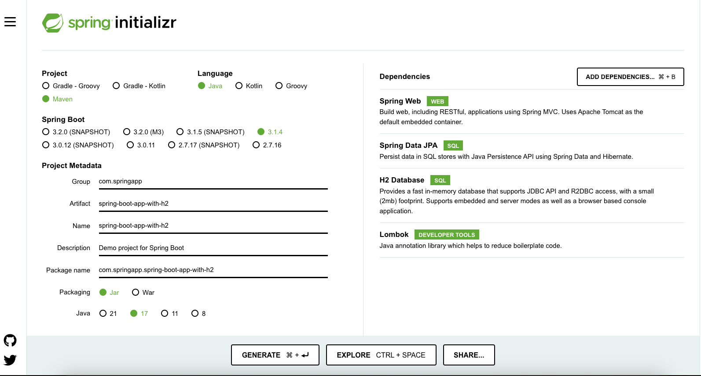
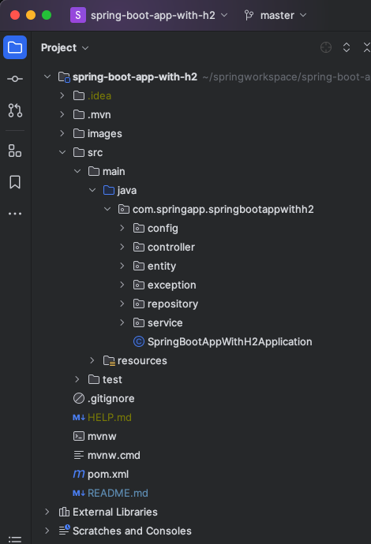

# Build Spring Boot CRUD Application with H2 Database

In this application, we are building a simple CRUD application with h2 for products.
Initially, we shall develop a basic web application utilizing Spring Boot, without resorting to Docker. Subsequently, we
shall construct a Docker image exclusively for the aforementioned application. Let’s get started.

## Pre-requisites

- [Java 17](https://www.oracle.com/java/technologies/downloads/)
- [Spring Boot CLI](https://docs.spring.io/spring-boot/docs/1.0.2.RELEASE/reference/html/getting-started-installing-spring-boot.html) (
  optional)
- [IntelliJ IDEA](https://www.jetbrains.com/edu-products/download/#section=idea)
- [Docker Desktop](https://docs.docker.com/desktop/?_gl=1*1sq9eto*_ga*MTMzMDc1Mjc4OC4xNjk2NTYwMzgy*_ga_XJWPQMJYHQ*MTY5NzQ2NjQwOS40LjEuMTY5NzQ2Nzg4Mi41OS4wLjA)

## Getting Started

After the successful installation of the tools on your system, please proceed to adhere to the following instructions in
order to construct a basic web application utilizing Spring Boot.

## Starting with Spring Initializr

[Spring Initializr](https://start.spring.io/) is a rapid initiation tool for Spring projects. It offers a flexible
application programming
interface (API) for generating projects based on the Java Virtual Machine (JVM), incorporating various fundamental
language generation options such as Java, Kotlin, and Groovy. Moreover, Spring Initializr facilitates the abstraction of
build systems by providing support for Apache Maven and Gradle implementations.
Furthermore, it exposes web endpoints that enable the generation of tangible projects and the provision of their
metadata in a widely recognized format. This
feature allows third-party clients to offer assistance in areas where it is required.

Open
this [pre-initialized project](https://start.spring.io/#!type=maven-project&language=java&platformVersion=3.1.4&packaging=jar&jvmVersion=17&groupId=com.springapp&artifactId=spring-boot-app-with-h2&name=spring-boot-app-with-h2&description=Demo%20project%20for%20Spring%20Boot&packageName=com.springapp.spring-boot-app-with-h2&dependencies=web,data-jpa,h2,lombok)
in order to generate a ZIP file. Here’s how that looks:

For the purpose of this demonstration, we have combined Maven build automation with Java, a Spring Web, Spring Data Jpa,
H2 database, Lombok dependencies, and Java 17 for our metadata.



Click “Generate” to download **“spring-boot-app-with-h2.zip”**. Use the unzip command to extract your files.

## Project Structure

Once you unzip the file, you’ll see the following project directory structure:

```text
tree spring-boot-app-with-h2 
spring-boot-app-with-h2
├── HELP.md
├── compose.yaml
├── mvnw
├── mvnw.cmd
├── pom.xml
└── src
    ├── main
    │ ├── java
    │ │ └── com
    │ │     └── springapp
    │ │         └── springbootappwithh2
    │ │             └── SpringBootAppWithH2Application.java
    │ └── resources
    │     ├── application.properties
    │     ├── static
    │     └── templates
    └── test
        └── java
            └── com
                └── springapp
                    └── springbootappwithh2
                        └── SpringBootAppWithH2ApplicationTests.java
```

- The `/src/main/java` directory contains project's source code
- The `/src/main/test` directory contains the test source, and the `pom.xml` file is your project's Project Object
  Model(POM)

The `pom.xml` file is the core of a Maven project’s configuration. It’s a single configuration file that contains most
of the information needed to build a customized project. The POM is huge and can seem daunting.
Here’s your project’s POM:

```xml
<?xml version="1.0" encoding="UTF-8"?>
<project xmlns="http://maven.apache.org/POM/4.0.0" xmlns:xsi="http://www.w3.org/2001/XMLSchema-instance"
         xsi:schemaLocation="http://maven.apache.org/POM/4.0.0 https://maven.apache.org/xsd/maven-4.0.0.xsd">
    <modelVersion>4.0.0</modelVersion>
    <parent>
        <groupId>org.springframework.boot</groupId>
        <artifactId>spring-boot-starter-parent</artifactId>
        <version>3.1.4</version>
        <relativePath/> <!-- lookup parent from repository -->
    </parent>
    <groupId>com.springapp</groupId>
    <artifactId>spring-boot-app-with-h2</artifactId>
    <version>0.0.1-SNAPSHOT</version>
    <name>spring-boot-app-with-h2</name>
    <description>Demo project for Spring Boot</description>
    <properties>
        <java.version>17</java.version>
    </properties>
    <dependencies>
        <dependency>
            <groupId>org.springframework.boot</groupId>
            <artifactId>spring-boot-starter-actuator</artifactId>
        </dependency>
        <dependency>
            <groupId>org.springframework.boot</groupId>
            <artifactId>spring-boot-starter-data-jpa</artifactId>
        </dependency>
        <dependency>
            <groupId>org.springframework.boot</groupId>
            <artifactId>spring-boot-starter-web</artifactId>
        </dependency>

        <dependency>
            <groupId>com.h2database</groupId>
            <artifactId>h2</artifactId>
            <scope>runtime</scope>
        </dependency>
        <dependency>
            <groupId>org.projectlombok</groupId>
            <artifactId>lombok</artifactId>
            <optional>true</optional>
        </dependency>
        <dependency>
            <groupId>org.springframework.boot</groupId>
            <artifactId>spring-boot-starter-test</artifactId>
            <scope>test</scope>
        </dependency>
    </dependencies>

    <build>
        <plugins>
            <plugin>
                <groupId>org.springframework.boot</groupId>
                <artifactId>spring-boot-maven-plugin</artifactId>
                <configuration>
                    <excludes>
                        <exclude>
                            <groupId>org.projectlombok</groupId>
                            <artifactId>lombok</artifactId>
                        </exclude>
                    </excludes>
                </configuration>
            </plugin>
        </plugins>
    </build>

</project>
```

The file `SpringBootAppWithH2Application.java` commences by declaring the `com.springapp.springbootappwithh2` package
and importing the requisite Spring frameworks. Numerous Spring Boot developers prefer their applications to employ
auto-configuration,
component scanning, and additional configuration definitions within their "application class."
To enable these functionalities, a solitary `@SpringBootApplication` annotation can be utilized. This annotation also
initiates component scanning for the present package and its sub-packages. It is possible to customize this
configuration and relocate it to
another location by explicitly specifying the base package.

Let us proceed to develop a basic CRUD RESTful web service on Products by means of creating separate packages like
config, controller, entity, exception, repository, and service as demonstrated in the subsequent example:



The H2 database is an in-memory database that is commonly employed for unit testing or proof-of-concept purposes. Spring
Boot offers exceptional integration support for H2 through straightforward properties configuration. In order to enhance
its usability, H2 also offers a console view that allows for the management and interaction with database tables and
data through a graphical user interface.

## Maven

In order to use in-memory database and perform CRUD operations, you need to add the below dependencies:

```xml

<dependency>
    <groupId>org.springframework.boot</groupId>
    <artifactId>spring-boot-starter-data-jpa</artifactId>
</dependency>
<dependency>
<groupId>com.h2database</groupId>
<artifactId>h2</artifactId>
<scope>runtime</scope>
</dependency>
```

## H2 Connection Properties

Spring provides effortless configuration options to connect to any database using properties. Below are the
configuration properties, we shall have in application.properties file for the most straightforward H2 configuration.

```properties
# Enabling H2 Console
spring.h2.console.enabled=true
#Turn Statistics on
spring.jpa.properties.hibernate.generate_statistics=true
logging.level.org.hibernate.stat=debug
# Show all queries
spring.jpa.show-sql=true
spring.jpa.properties.hibernate.format_sql=true
logging.level.org.hibernate.type=trace
spring.datasource.url=jdbc:h2:mem:testdb
spring.data.jpa.repositories.bootstrap-mode=default
#Initializing Schema and Data at Startup
spring.jpa.defer-datasource-initialization=true
```

Please note that, by default, Spring Boot configures the connection to the in-memory database with the username `sa` and
an empty password. Should you desire to modify the username and password, it is necessary to override them within the
aforementioned properties options.

- `data.sql` - used for an initial data load to in-memory database

## Application Code

- `ProductController.java`- Acts as a presentation layer where you define all the http endpoints
- `Product.java` - Act as a POJO class and table structure with attributes in the form of Java class
- `ProductRepository.java` - Interface which extends JpaRepository which is available from Spring
- `ProductService.java, ProductServiceImpl.java`- Classes for defining method and implementing those methods in
  ProductServiceImpl class
- `Exception` folder - defined for the complete application exception handling
- `Config` folder - defined for the Swagger OpenAPI

## Dockerize the Application

Starting from Spring Boot 2.3 added support for [buildpacks](https://buildpacks.io/), using this we don't manually
create Dockerfile and building
it
using something like `docker build`, all we need to do is a simple configuration in the `pom.xml` under
the `spring-boot-maven-plugin`

```xml
 
<image>
    <name>bsmahi/${project.artifactId}:${project.version}</name>// here replace `bsmahi` with user docker user name
</image>
<pullPolicy>IF_NOT_PRESENT</pullPolicy>
```

And complete configuration is as follows

```xml

<plugin>
    <groupId>org.springframework.boot</groupId>
    <artifactId>spring-boot-maven-plugin</artifactId>
    <configuration>
        <excludes>
            <exclude>
                <groupId>org.projectlombok</groupId>
                <artifactId>lombok</artifactId>
            </exclude>
        </excludes>
        <image>
            <name>bsmahi/${project.artifactId}:${project.version}</name>
        </image>
        <pullPolicy>IF_NOT_PRESENT</pullPolicy>
    </configuration>
</plugin>
```

And then, execute the following command in the CLI

**NOTE:** **For this to work, we need to have Docker installed and running.**

- **mvn spring-boot:build-image**